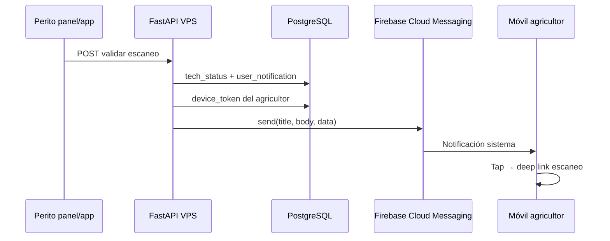

# NEXO Agro — Roadmap notificaciones y badges

**Autor:** Valentín Ruiz León  
**Actualizado:** 25 ago 2026  
**Rama:** `nexoagro`  
**Estado:** 📋 Planificado — próximo hito post-PlagaScan UI (top-3 + confianza baja)  
**Producción:** `https://agroplaga-ai.farm`

Documento de referencia para **puntos rojos (badges)**, **notificaciones in-app** y **push real (FCM)** en app móvil agricultor y perito + panel web.

---

## Resumen ejecutivo

| Capa | Qué es | Estado actual |
|------|--------|---------------|
| **Notificación in-app** | Registro en BD («tienes 2 sin leer») | Perito: `tech_notifications` ✅ · Agricultor: ❌ |
| **Punto rojo (badge)** | Indica sección con pendientes no vistos | Panel web perito (Validar escaneos) ✅ · App móvil: ❌ |
| **Polling + SnackBar** | App pregunta al servidor cada ~30 s | Perito app ✅ · Agricultor ❌ |
| **Push FCM** | Notificación del sistema con app cerrada | Stub (`print`) ❌ — no llega al móvil |

**Principio de diseño:** badge = «hay algo sin mirar»; push = solo si es **accionable**, **urgente** o **esperado** (p. ej. el agricultor pidió validación al perito).

---

## Estimación de esfuerzo

| Fase | Alcance | Tiempo (1 dev) |
|------|---------|----------------|
| **1 — MVP in-app** | BD agricultor + badges + polling + hook `validate_scan` | **3–4 días** |
| **1 + FCM Android** | Lo anterior + Firebase + `device_tokens` + Admin SDK VPS | **6–8 días** total |
| **2 — Prevención** | Carencia cumplida, alertas comarcal, SIEX/SIGPAC pendiente | **+2–3 días** |
| **3 — Pulido** | Incidencias CRM, anti-spam/agrupación, preferencias, horario quieto | **+2–3 días** |
| **Completo (1–3 + FCM)** | | **10–14 días laborables** |

**Recomendación piloto:** Semana 1 → Fase 1 sin FCM. Semana 2 → FCM Android en 3 eventos críticos (confirm / correct / reject).

---

## División de responsabilidades (implementación)

### Agente / código (repo)

- Backend: `user_notifications`, `device_tokens`, endpoints `activity-summary` / `activity-seen`
- Hook en `validate_scan()` → notificar agricultor
- Sustituir stub `send_push_to_user` por Firebase Admin SDK
- Flutter: badges en `NexoActionTile`, polling, registrar FCM token al login, deep links
- Tests + documentación de variables VPS

### Usuario / operaciones (una vez + deploy)

| Paso | Tiempo | Notas |
|------|--------|-------|
| Crear proyecto Firebase + app Android | ~15–30 min | Package name de `frontend/android/app/build.gradle` |
| Descargar `google-services.json` | | → `frontend/android/app/` (idealmente `.gitignore`) |
| JSON cuenta de servicio → VPS | ~10 min | Variable `FIREBASE_CREDENTIALS` — **nunca en git** |
| Deploy backend + migraciones + nueva APK | | `git pull`, restart API, `flutter build apk` |
| Prueba en móvil Android real | ~15 min | Permiso notificaciones + flujo perito valida |

**iOS:** requiere Apple Developer (~99 €/año) — pospuesto; piloto con APK Android.

---

## Arquitectura push (FCM)

**Piezas técnicas:**

1. **Firebase Console** — proyecto + app Android + `google-services.json`
2. **Flutter** — `firebase_core`, `firebase_messaging`, `flutter_local_notifications`
3. **Backend** — tabla `device_tokens`, `POST /api/v1/me/device-token`, `firebase-admin`
4. **VPS** — credenciales JSON como secreto de entorno

Hoy: `backend/app/services/notification_service.py` solo hace `print`. Perito ya crea filas en `tech_notifications` al compartir escaneo pero el push no sale.

---

## Eventos — PERITO

### Push + badge (alta prioridad)

| Evento | Mensaje ejemplo | Badge |
|--------|-----------------|-------|
| Nuevo escaneo compartido (`share_with_tech`) | «María compartió escaneo: tomate · trips» | Validar escaneos |
| Agricultor corrige plaga en escaneo en cola | «María cambió la plaga a tuta — revisar» | Validar escaneos |
| Incidencia nueva en cartera de pilotos (si hay asignación) | «Nueva incidencia: mildiu en finca X» | Incidencias |

### Solo badge (sin push)

| Evento | Badge |
|--------|-------|
| Escaneos pendientes en cola (`pending_scans > 0`) | Validar escaneos |
| Entradas SIEX pendientes validación (enterprise) | SIEX |
| Alertas comarcal nuevas (dashboard) | Dashboard / Mapa |

### No notificar (evitar spam)

- Cada foco anónimo nuevo en mapa
- Feedback «¿Te resultó útil?» del agricultor
- Clima rutinario sin umbral crítico

**Canal principal perito:** panel web (`Layout.tsx` ya tiene badge + Notification API). App móvil como complemento.

---

## Eventos — AGRICULTOR

### Push + badge (alta prioridad)

| Evento | Mensaje ejemplo | Badge |
|--------|-----------------|-------|
| Perito **confirma** escaneo | «Tu perito confirmó: trips» | Historial |
| Perito **corrige** plaga | «Tu perito indica: tuta (no trips)» | Historial |
| Perito **rechaza** escaneo | «Escaneo no válido — repite foto o consulta» | Historial |
| **Carencia cumplida** | «APTO PARA CORTE — plazo cumplido» | Inicio |
| Carencia crítica (&lt;24 h, opcional) | «Quedan 18 h de carencia» | Inicio |

### Push + badge (media — comarcal)

| Evento | Mensaje ejemplo | Badge |
|--------|-----------------|-------|
| Alerta nueva en municipio/zona del usuario | «Pico de trips en El Ejido» | Alertas |
| Foco relevante en comarca (incidencia validada) | «Actividad de mildiu en tu comarca» | Mapa |

Respetar `user_alert_preferences` (por plaga).

### Solo badge (sin push)

| Evento | Badge |
|--------|-------|
| Escaneo compartido sin respuesta del perito (X días) | Historial |
| Incidencia: cambio de etapa CRM | Incidencias |
| SIEX pendiente SIGPAC | Mis fincas / SIEX |
| Borrador SIEX tras tratamiento | SIEX |
| Nueva medalla gamificación | Comunidad |

### Banner in-app (ya parcial)

- Carencia activa → `CarenciaBanner` (no push cada hora)
- Confianza baja en último escaneo → recordatorio al abrir app

### No notificar

- «Diagnóstico guardado» tras cada escaneo propio
- Mapa comarcal genérico sin relación con fincas/plagas del usuario
- Onboarding repetitivo (&gt;1/día)

---

## Mapa badge ↔ UI (app agricultor)

| Botón / sección | Punto rojo cuando… |
|-----------------|-------------------|
| **Historial** | Validación perito no vista; escaneo pendiente de revisar |
| **Alertas** | Alerta activa nueva en zona del usuario |
| **Incidencias** | Incidencia abierta con cambio desde última visita |
| **Mapa** | (opcional) foco nuevo en municipio de sus fincas |
| **Mis fincas** | SIGPAC obligatorio pendiente para SIEX |
| **SIEX** | Entrada pendiente validación o `pendiente_sigpac` |
| **Tab Field (inicio)** | Agregado si cualquier sub-sección tiene pendiente |

## Mapa badge ↔ UI (perito app + panel)

| Destino | Punto rojo cuando… |
|---------|-------------------|
| **Validar escaneos** | `pending_scans > 0` o notificaciones unread |
| **Eventos mapa** | Outbreak events pendientes |
| **SIEX (panel)** | Cola enterprise pendiente |
| **Inicio / nav** | Agregado si hay cola en cualquier módulo |

---

## Matriz push vs badge

| Evento | Agricultor push | Agricultor badge | Perito push | Perito badge |
|--------|:---------------:|:----------------:|:-----------:|:------------:|
| Escaneo compartido con perito | — | opcional | ✅ | ✅ |
| Perito confirma / corrige / rechaza | ✅ | ✅ | — | — |
| Alerta comarcal (zona/plaga) | ✅* | ✅ | — | ✅ |
| Carencia cumplida | ✅ | ✅ | — | — |
| Carencia activa | banner | banner | — | — |
| Incidencia: cambio etapa | — | ✅ | — | ✅ |
| SIEX pendiente SIGPAC | — | ✅ | — | — |
| SIEX pendiente validación | — | — | — | ✅ |

\*Solo si preferencia de alerta activa para esa plaga.

---

## Fases de implementación (checklist)

### Fase 1 — MVP in-app (sin FCM)

**Backend**

- [ ] Migración: tabla `user_notifications` (genérica: `user_id`, `type`, `scan_id?`, `title`, `body`, `is_read`, `created_at`)
- [ ] Migración o tabla `user_activity_seen` (`user_id`, `section`, `seen_at`)
- [ ] Servicio `farmer_notification_service` (crear, listar, unread, mark read)
- [ ] Hook en `tech_scan_service.validate_scan()` → notificar `scan.user_id`
- [ ] `GET /api/v1/me/notifications` + `GET /api/v1/me/activity-summary` + `PATCH /api/v1/me/activity-seen`
- [ ] Tests: validación perito crea notificación agricultor

**Flutter agricultor**

- [ ] `NexoActionTile`: prop `showBadge` (punto rojo 8 px)
- [ ] Repositorio + polling en `FieldHomeScreen` (30–60 s, tab activa)
- [ ] Badge en **Historial**; limpiar al abrir pantalla
- [ ] SnackBar cuando `unread_count` sube (patrón perito existente)
- [ ] Deep link desde SnackBar → `Routes.result`

**Flutter / panel perito**

- [ ] Unificar criterio badge Validar escaneos (app + panel)
- [ ] Refinar textos notificación escaneo compartido

**Criterio de done Fase 1:** agricultor ve badge + SnackBar al validar perito con app abierta; historial marca leído.

---

### Fase 1b — Push FCM Android

**Infra (usuario)**

- [ ] Proyecto Firebase + `google-services.json`
- [ ] JSON cuenta de servicio en VPS (`FIREBASE_CREDENTIALS`)

**Backend**

- [ ] Migración `device_tokens` (`user_id`, `token`, `platform`, `updated_at`)
- [ ] `POST /api/v1/me/device-token`
- [ ] Sustituir `notification_service.send_push_to_user` por Firebase Admin SDK
- [ ] Payload `data`: `type`, `scan_id` para deep link

**Flutter**

- [ ] Dependencias Firebase + permiso Android 13+
- [ ] Registrar token tras login / refresh token
- [ ] Handler foreground (`flutter_local_notifications`)
- [ ] Tap notificación → navegar a escaneo

**Criterio de done Fase 1b:** push llega con app cerrada en Android piloto (confirm / correct / reject).

---

### Fase 2 — Prevención y cumplimiento

- [ ] Push + badge carencia cumplida (`harvest_allowed`)
- [ ] Alert engine → notificar usuarios en zona (filtrar por finca/municipio + `user_alert_preferences`)
- [ ] Badge SIEX `pendiente_sigpac` + finca sin SIGPAC
- [ ] Badge alertas comarcal

---

### Fase 3 — Pulido

- [ ] Incidencias CRM: notificar cambio de etapa
- [ ] Agrupación anti-spam («3 escaneos pendientes» en ventana 10 min)
- [ ] No re-notificar mismo evento sin cambio de estado
- [ ] Preferencias en Ajustes (tipo de notificación on/off)
- [ ] Horario quieto opcional (22:00–07:00: solo badge, push critical)
- [ ] Digest diario opcional perito

---

## Reglas anti-spam

1. **Agrupar** eventos similares en ventana corta (10 min).
2. **No repetir** si el estado no cambió.
3. **Deep link** siempre al recurso concreto (`scan_id`, `incident_id`).
4. **Marcar leído** al entrar en la pantalla destino, no solo al abrir la app.
5. **Horario quieto** opcional para push no críticos.

---

## Canales por rol y estado de app

| Rol | App abierta | Segundo plano | App cerrada |
|-----|-------------|---------------|-------------|
| Agricultor | Badge + SnackBar | FCM + badge | FCM |
| Perito panel | Badge nav | Notification API | Notification API |
| Perito app | Badge + SnackBar | FCM + badge | FCM |

---

## Preguntas abiertas (cerrar antes de Fase 1b)

- [ ] ¿Perito usa más **panel web** o **app móvil** en piloto? (priorizar canal)
- [ ] ¿Asignación **agricultor ↔ perito** o todos los peritos ven todos los escaneos?
- [ ] ¿Push en **carencia cumplida** siempre o solo badge + `CarenciaBanner`?
- [ ] ¿Alertas comarcal a **todo el municipio** o solo usuarios con finca en esa zona?

---

## Referencias en código

| Pieza | Ubicación |
|-------|-----------|
| Stub push | `backend/app/services/notification_service.py` |
| Notificaciones perito | `backend/app/services/tech_notification_service.py` |
| Hook escaneo compartido | `backend/app/api/v1/routes/scans.py` |
| Validación perito | `backend/app/services/tech_scan_service.py` |
| Badge panel web | `web-panel/src/components/Layout.tsx` |
| Polling perito app | `frontend/lib/ui/screens/field_home_screen.dart` |
| Preferencias alerta plaga | `backend/app/models/alert_preference.py` |
| Motor alertas comarcal | `backend/app/services/alert_engine.py` |

---

## Registro

| Fecha | Hito |
|-------|------|
| 25 ago 2026 | Plan notificaciones + badges + FCM documentado (este archivo) |
| 25 ago 2026 | UI PlagaScan: top-3 plagas + banner confianza baja (pre-requisito UX) |

---

*Vinculado desde [ROADMAP_NEXO.md](ROADMAP_NEXO.md). Marcar `[x]` al completar tareas.*
